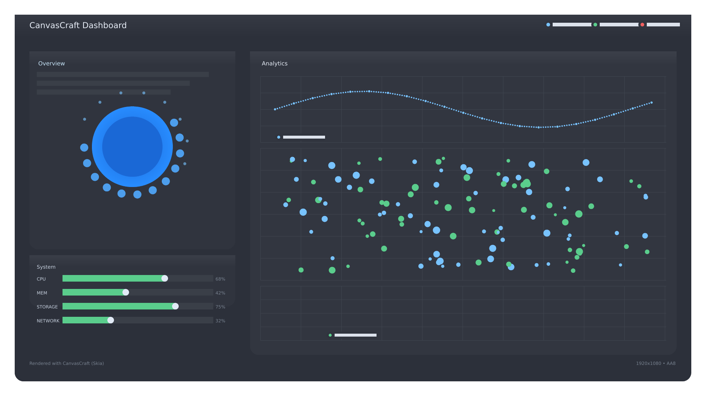

# CanvasCraft


In-memory 2D rendering with a Skia backend (Rustler NIF). 100% declarative Scene DSL for charts and UI-like scenes.

## Install
Add to `mix.exs`:

```elixir
{:canvas_craft, "~> 0.1.0"}
```

This builds a small native library (Rust). You need a Rust toolchain (`rustup` recommended).

## Requirements
- Elixir >= 1.16, OTP >= 26
- Rust toolchain (required to compile the NIF)
- macOS or Linux (x86_64/arm64). Windows WSL works (experimental)

## Features
- Real in-memory WEBP export (no temp files)
- Raw RGBA buffer access
- Declarative DSL with named properties and per-element antialiasing
- Primitives: clear, rect, circle; composites: panel, donut_segment, grid, scatter, progress_bar, line_chart, candle_chart

## Preview



## Quickstart (Declarative DSL)

Minimal scene:

```elixir
import CanvasCraft.Scene

render width: 128, height: 128, path: "out.webp" do
  rect x: 16, y: 16, w: 96, h: 96, color: {0, 128, 255, 255}
end
```

Skia backend is default. To get a binary instead of a file:

```elixir
import CanvasCraft.Scene
{:ok, webp} = render width: 320, height: 240 do
  circle cx: 120, cy: 120, r: 80, color: {30, 180, 90, 255}
end
File.write!("circle.webp", webp)
```

## DSL essentials
- Colors: RGBA tuples `{r,g,b,a}` with 0..255 components
- Antialiasing: `aa 1 | 4 | 8` (can be set globally or per element)
- Coordinate system: pixels, origin at top-left
- Named properties on all elements: `rect x:, y:, w:, h:, color:` etc.

## Examples
- `examples/kitchensink` – 1080p dashboard using the DSL

Run KitchenSink:

```sh
cd examples/kitchensink
mix deps.get
mix run -e 'KitchenSink.render("output.webp")'
file output.webp # should report RIFF WebP
```

Alternative script form:

```sh
cd examples/kitchensink
mix deps.get
mix run script.exs
```

## Tech details
- Backend: Skia-like raster implemented as a Rust NIF (via Rustler)
- Public API: `CanvasCraft` module (in-memory export, raw buffer)
- DSL: `CanvasCraft.Scene` macro composes scenes and scopes AA
- Encoding: WEBP (lossless); raw RGBA buffer for custom pipelines

## Platforms & build
- Compiles the NIF at dependency build time
- Needs: Rust (`rustup toolchain install stable`), clang/LLVM on Linux

## Troubleshooting
- NIF fails to load: ensure Rust toolchain is installed and on PATH
- Compile errors about clang: install build tools (`xcode-select --install` on macOS; `build-essential` on Ubuntu)

## Contributing
See `CONTRIBUTING.md`. CI runs format, Credo, Dialyzer, tests, and non-blocking benches.

## License
MIT
